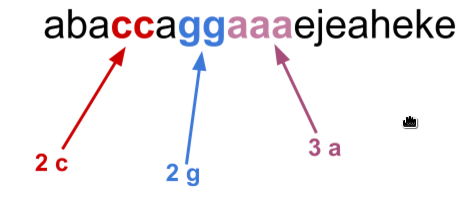

La seqüència repetida més llarga
=================================================
En una cadena aleatòria, o no, de caràcters a vegades hi ha algun caràcter que es repeteix diverses vegades.

Una de les coses que es pot fer fàcilment amb programes és localitzar aquestes seqüències i fins i tot trobar-ne les que compleixin alguna condició.

Activitat
-------------------
Trobar la seqüència més llarga d'una cadena de caràcters (variable) 

Desenvolupeu un programa que donat un String qualsevol us diu quina és la seqüència de lletres repetides més llarga i quina lletra és

    abaaadbbe  → a:3
    abbadcaab  → b:2

.

.

.

.

.

.

.

.

.

.

.

.

(no oblideu que la més repetida pot ser més d'una ... )

    aabb → a,b:2
    aadccstmbsbb → a,c,b:2
